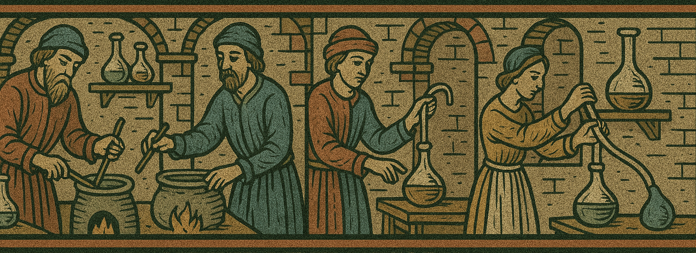

# CK3 Custom Labs

A simple mod satisfying my need to min-max cultures, religions and other stuff in CK3.

## Table of Contents

- [Table of Contents](#table-of-contents)
- [Cultures](#cultures)
  - [Lords of the Lush Lands](#lords-of-the-lush-lands)

## Cultures

### Lords of the Lush Lands

A Culture that prospered in the lush lands near rivers and centers of trade.
Due to their prosperous core lands, they are able to fuel grand armies of heavy cavlary to dominate anyone in their way.
